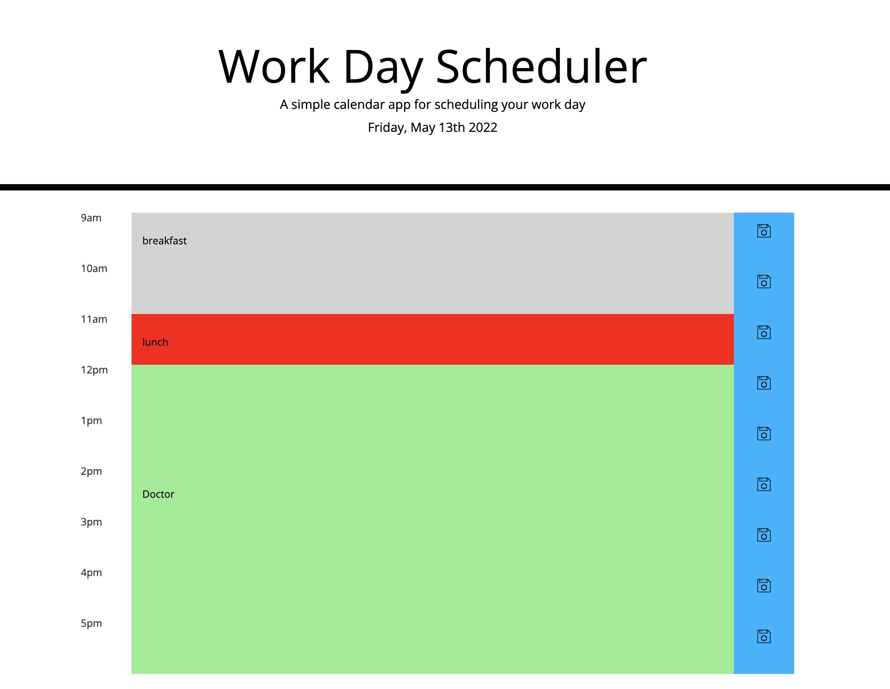

# Work Day Scheduler Starter Code

This application provides users with a simple calendar system to schedule their work day. You can click any appointment to enter a description, then press the corresponding blue save button to store that appointment. Appointments are stored and accessible between sessions (refreshing the browser). Appointment times are highlighted according to the following three criteria: 
- Past appointments: Grey
- Current Appointment: Red
- Upcoming Appointments: Green

Sample application screenshot:

Link to [Deployed Application](https://michaelpalumbo.github.io/wds/)